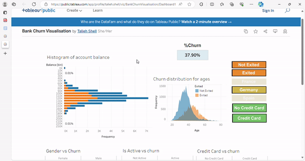
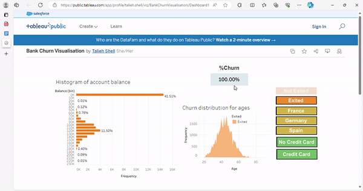
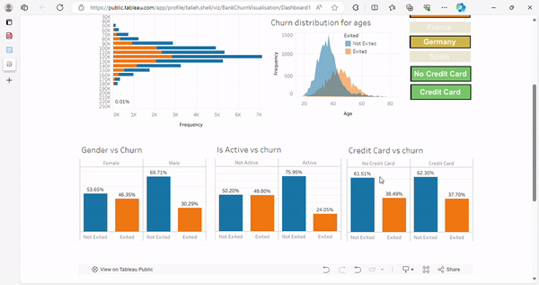

# **Bank Churn Analysis and Prediction using Machine Learning Techniques**

<p align="center">

</p>

# Table of Contents


1. [Project Overview](#project-overview)
2. [Analytics Dashboard (Preview)](#analytics-dashboard-preview)
3. [Contributions](#contributions)
4. [Final Repository Structure](#final-repository-structure)
5. [Bank churn data Overview](#crime-dataset-overview)
6. [Target Audience](#target-audience)
7. [Visualisations](#visualisations)
8. [Launch](#launch)
9. [App Server Setup](#app-server-setup)

## Project Overview
The bank churn prediction project aims to utilize machine learning techniques to predict whether a bank customer is likely to churn (leave) or remain loyal. And also Tableau was utilized for data visualization to analyze patterns and trends within the dataset, providing valuable insights for model training and interpretation.

### The project encompasses several key components:

1. **Data Preparation:** The dataset containing relevant features such as credit score, age, tenure, balance, and more was obtained and cleaned using Python. The cleaned data was then stored in a PostgreSQL database on Neon Cloud services.

2. **Machine Learning Model:** Various machine learning models, including Logistic Regression, Random Forest, XGBoost, and Neural Network, were trained and evaluated using the dataset. Metrics such as accuracy were used to compare the models, and the best-performing model was selected for deployment.

3. **Flask App:** A Flask web application was developed to provide a user-friendly interface for inputting customer data and obtaining churn predictions. The app utilizes the selected machine learning model to make real-time predictions.

4. **Visualization:** Tableau was utilized for data visualization to analyze patterns and trends within the dataset, providing valuable insights for model training and interpretation.

5. **API Endpoint:** An API endpoint was implemented to allow access to sample data from the Bank Churn database, facilitating further analysis or integration with other systems.
   
6. **Deployment to the cloud:** Used Docker for encapsulating the application with all its dependencies into a uniform package. This package was then deployed to the cloud through fly.io, serving as the hosting platform, and ensuring the application's availability online.

   
### Technologies used

- [Tensorflow](https://www.tensorflow.org/api_docs/python/tf)
- [Flask](https://flask.palletsprojects.com/)
- [RandomForest](https://scikit-learn.org/stable/modules/generated/sklearn.ensemble.RandomForestClassifier.html)
- [XGBoost](https://xgboost.readthedocs.io/en/stable/)
- [Regression](https://scikit-learn.org/stable/modules/generated/sklearn.linear_model.LinearRegression.html)
- [Docker](https://docs.docker.com/)
- [Imblearn](https://imbalanced-learn.org/stable/)
- [Joblib] (https://joblib.readthedocs.io/en/stable/)
  
## Analytics Dashboard (Preview)


## Contributions
* **Rohit**
  -
* **Tallieh**
     - [PostgreSQL] Database schema design + setup
     - [Python Flask / SQLAlchemy] Development of Flask to create a web application that can interact with databases, perform computations or predictions, and render results dynamically on a web page.
     - [Cloud-Based App Hosting] Migration of entire project solution to fli.io Cloud
     - [Frontend] Full Web development of Flask Application Landing Page (HTML), visualization page
     - [Tableau] Additional support with creating visualization in Tableau
     - [Docker] Created docker files to facilitate running the application on cloud.
     - 
* **Michael**
  -
* **Simon**
  -


## Final Repository Structure
```
├── README.md
├── .gitignore
├── app.py
├── 'templates' Folder
├── 'static' Folder
├── 
├── 'Images' Folder
└── '_localhost' Folder
    ├── index.html
    ├── app_local.py
    ├── 'templates' Folder
    └── 'static' Folder
```


--------------------------------------------------------------------------------------------------------------------------------------------------------------------------
## Bank Churn Dataset Overview

- `id`: A unique identifier for each entry.
- `CustomerId`: A unique identifier for each customer.
- `Surname`: The surname of the customer.
- `CreditScore`: The credit score of the customer.
- `Geography`: The geographical location of the customer.
- `Gender`: The gender of the customer.
- `Age`: The age of the customer.
- `Tenure`: Number of years the customer has been with the bank.
- `Balance`: The bank balance of the customer.
- `NumOfProducts`: The number of products the customer has with the bank.
- `HasCrCard`: Indicates if the customer has a credit card (1) or not (0).
- `IsActiveMember`: Indicates if the customer is an active member (1) or not (0).
- `EstimatedSalary`: The estimated salary of the customer.
- `Exited`: Indicates if the customer has exited (1) or not (0).

--------------------------------------------------------------------------------------------------------------------------------------------------------------------------
## Target Audience
1. **Banking Institutions:** This project is particularly useful for banking institutions seeking to reduce customer churn rates. Banks can utilize the machine learning model deployed in the Flask web application to predict which customers are at risk of leaving. By identifying at-risk customers early, banks can implement targeted retention strategies to retain valuable customers and improve overall customer satisfaction.

2. **Marketing and Customer Retention Teams**: Marketing and customer retention teams within banking institutions can benefit from the insights provided by this project. They can use the predictions generated by the machine learning model to tailor marketing campaigns and retention efforts towards customers identified as likely to churn. This targeted approach can lead to more effective and cost-efficient retention strategies.

3. **Data Analysts and Data Scientists:** Data analysts and data scientists who are interested in predictive analytics and machine learning can also find value in this project. They can explore the dataset, evaluate different machine learning models, and gain insights into feature importance and model performance. Additionally, they can leverage the Flask web application and API endpoint to interact with the machine learning model and explore its predictions.

4. **Business Decision Makers:** Business decision makers, such as executives and managers within banking institutions, can use the insights generated by this project to inform strategic decisions. By understanding customer churn patterns and predicting future churn behavior, decision makers can allocate resources more effectively, prioritize customer retention efforts, and ultimately drive business growth and profitability.


--------------------------------------------------------------------------------------------------------------------------------------------------------------------------
## Visualisation

## Interactive Visualisations
### ** Interactive Tableau Dashboard**
This Tableau Dashboard contains:
1)      An interactive histogram that shows the distribution of account balance of the dataset, as well as an interactive area chart that shows the Churn distribution across age range. The visualisations can be altered by clicking the slicer buttons to filter based on which country the user wants to see distribution for:
<p align="center">
  
</p>
This histogram and area chart can also be filtered based on whether the customer from the dataset ‘churned’ (left the bank), or didn’t churn:
<p align="center">
  
</p>
Additionally, the histogram and area chart can be filtered on whether the customer had a credit card with the bank or not.
<p align="center">
  
</p>
Whenever these filters are used, the dashboard updates to show the churn rate of the selected portion of the dataset
 
2)      Interactive bar charts that show the significance of gender, credit card ownership and active membership versus customer loyalty. These bar charts can also be filtered based on the country selected:
<p align="center">
  
</p>
 


---

## Launch


---

## App Server Setup 
